# Architecture Diagrams - AI SDLC Co-Pilot

Visual documentation of the Docker architecture and system design.

---

## 1. High-Level System Architecture

How the entire MVP-Free system connects:

```mermaid
flowchart TB
    subgraph Browser["🌐 Browser"]
        User["👤 User"]
    end

    subgraph Docker["🐳 Docker Compose"]
        subgraph FrontendContainer["Frontend Container"]
            Vite["⚡ Vite Dev Server<br/>:5173"]
        end
        
        subgraph BackendContainer["Backend Container"]
            FastAPI["🐍 FastAPI + Uvicorn<br/>:8000"]
        end
    end

    subgraph CloudFree["☁️ Free Cloud Services ($0/month)"]
        Supabase[("🐘 Supabase Postgres<br/>500MB Free")]
        Upstash[("🔴 Upstash Redis<br/>10K cmd/day")]
        Gemini["🤖 Google Gemini<br/>15 RPM Free"]
        Groq["⚡ Groq LLaMA<br/>30 RPM Free"]
        GitHub["🐙 GitHub OAuth<br/>Free"]
    end

    User -->|"http://localhost:5173"| Vite
    Vite -->|"/api/* proxy"| FastAPI
    FastAPI -->|"SQL"| Supabase
    FastAPI -->|"Cache"| Upstash
    FastAPI -->|"LLM API"| Gemini
    FastAPI -->|"LLM API"| Groq
    FastAPI -->|"OAuth"| GitHub
```

---

## 2. Docker Container Architecture

Detailed view of what's inside each container:

```mermaid
flowchart LR
    subgraph YourComputer["💻 Your Computer"]
        subgraph Volumes["📁 Mounted Volumes"]
            BackendCode["./backend"]
            FrontendCode["./frontend"]
            PromptsCode["./prompts"]
            EnvFile[".env"]
        end
    end

    subgraph DockerNetwork["🐳 Docker Network"]
        subgraph Frontend["frontend container"]
            direction TB
            NodeImg["node:20-alpine"]
            ViteDev["Vite Dev Server"]
            HMR["Hot Module Replacement"]
            NodeImg --> ViteDev --> HMR
        end

        subgraph Backend["backend container"]
            direction TB
            PythonImg["python:3.11-slim"]
            Uvicorn["Uvicorn ASGI Server"]
            FastAPIApp["FastAPI Application"]
            PythonImg --> Uvicorn --> FastAPIApp
        end
    end

    BackendCode -.->|"sync"| Backend
    FrontendCode -.->|"sync"| Frontend
    PromptsCode -.->|"read-only"| Backend
    EnvFile -.->|"env vars"| Backend
    EnvFile -.->|"env vars"| Frontend

    Frontend -->|"http://backend:8000"| Backend
```

---

## 3. Request Flow - How HTTP Requests Travel

What happens when you visit a page:

```mermaid
flowchart TD
    subgraph Step1["1️⃣ Browser Request"]
        Browser["Browser: GET http://localhost:5173/dashboard"]
    end

    subgraph Step2["2️⃣ Vite Dev Server"]
        Vite{"Is it /api/* ?"}
        ServeReact["Serve React App<br/>(index.html + JS)"]
    end

    subgraph Step3["3️⃣ React Handles Route"]
        ReactRouter["React Router sees /dashboard"]
        Dashboard["Renders Dashboard component"]
    end

    subgraph Step4["4️⃣ Dashboard Fetches Data"]
        FetchAPI["fetch('/api/projects')"]
    end

    subgraph Step5["5️⃣ API Request"]
        ViteProxy["Vite proxies to backend:8000"]
        FastAPI["FastAPI handles /projects"]
        DB["Query Supabase"]
    end

    subgraph Step6["6️⃣ Response"]
        JSON["Return JSON"]
        Render["React renders data"]
    end

    Browser --> Vite
    Vite -->|"No"| ServeReact
    ServeReact --> ReactRouter --> Dashboard
    Dashboard --> FetchAPI
    FetchAPI --> ViteProxy --> FastAPI --> DB
    DB --> JSON --> Render
```

---

## 4. Backend Dockerfile - Build Process

Step-by-step visualization of how the backend image is built:

```mermaid
flowchart TB
    subgraph Layer1["Layer 1: Base Image"]
        Base["FROM python:3.11-slim<br/>📦 ~150MB"]
    end

    subgraph Layer2["Layer 2: System Deps"]
        Apt["RUN apt-get install gcc<br/>🔧 C compiler for some packages"]
    end

    subgraph Layer3["Layer 3: Python Deps"]
        Reqs["COPY requirements.txt<br/>RUN pip install<br/>📚 FastAPI, Pydantic, etc."]
    end

    subgraph Layer4["Layer 4: App Code"]
        Code["COPY . .<br/>🐍 Your Python code"]
    end

    subgraph Layer5["Layer 5: Security"]
        User["RUN useradd appuser<br/>USER appuser<br/>🔒 Non-root user"]
    end

    subgraph Final["Final: Runtime"]
        Run["CMD uvicorn app.main:app<br/>🚀 Start server on :8000"]
    end

    Layer1 --> Layer2 --> Layer3 --> Layer4 --> Layer5 --> Final

    style Layer3 fill:#90EE90
    style Final fill:#87CEEB
```

**Cache Optimization**: If you only change your Python code, layers 1-3 are cached (green). Only layer 4 rebuilds!

---

## 5. Frontend Dockerfile - Development Build

How the frontend container works with Vite:

```mermaid
flowchart TB
    subgraph DevContainer["🏗️ Development Container"]
        direction TB
        NodeBase["FROM node:20-alpine<br/>📦 Base image"]
        NPM["npm ci<br/>Install dependencies"]
        ViteDev["npm run dev<br/>Start Vite server"]
        
        NodeBase --> NPM --> ViteDev
        
        subgraph Features["Development Features"]
            F1["⚡ Hot Module Replacement"]
            F2["🔄 Auto-reload on save"]
            F3["🐛 Source maps for debugging"]
            F4["📁 Volume mount for live sync"]
        end
    end

    subgraph Browser["🌐 Browser"]
        App["React App"]
        WS["WebSocket connection"]
    end

    ViteDev -->|"Serves on :5173"| App
    ViteDev <-->|"HMR updates"| WS

    style Features fill:#90EE90
```

**Note**: For production deployment, Railway/Render handle building and serving automatically.

---

## 6. Vite Request Routing

How Vite dev server handles different requests:

---

## 7. Health Check Flow

How Docker monitors container health:

```mermaid
flowchart LR
    subgraph DockerDaemon["🐳 Docker Daemon"]
        Timer["Every 30 seconds"]
        Check["Run health check"]
        Evaluate{"Exit code?"}
        Healthy["✅ Healthy"]
        Unhealthy["❌ Unhealthy"]
        Restart["🔄 Restart Container"]
    end

    subgraph Container["Container"]
        HealthEndpoint["/health endpoint"]
        App["FastAPI App"]
    end

    Timer --> Check
    Check -->|"GET /health"| HealthEndpoint
    HealthEndpoint --> App
    App -->|"200 OK"| Evaluate
    App -->|"Error/Timeout"| Evaluate
    Evaluate -->|"0"| Healthy
    Evaluate -->|"1 (3 times)"| Unhealthy
    Unhealthy --> Restart
```

---

## 8. Volume Mounts - Code Sync

How your local files sync into containers:

```mermaid
flowchart LR
    subgraph Local["💻 Your Computer"]
        L1["./backend/app/main.py"]
        L2["./frontend/src/App.tsx"]
        L3["./prompts/test-gen.md"]
        L4[".env"]
    end

    subgraph Backend["🐳 Backend Container"]
        B1["/app/app/main.py"]
        B2["/app/prompts/test-gen.md"]
        B3["Environment Variables"]
    end

    subgraph Frontend["🐳 Frontend Container"]
        F1["/app/src/App.tsx"]
        F2["VITE_API_URL env"]
    end

    L1 <-->|"Read/Write Sync"| B1
    L2 <-->|"Read/Write Sync"| F1
    L3 -->|"Read-Only :ro"| B2
    L4 -.->|"Parsed by Docker"| B3
    L4 -.->|"Parsed by Docker"| F2

    style L3 fill:#FFE4B5
    style B2 fill:#FFE4B5
```

**Note**: The `:ro` (read-only) mount on prompts prevents accidental modifications from inside the container.

---

## 9. Environment Variables Flow

How secrets and config flow through the system:

---

## 10. Complete MVP-Free Architecture

Everything in one diagram:

```mermaid
flowchart TB
    subgraph User["👤 Developer"]
        Browser["🌐 Browser"]
        VSCode["📝 VS Code"]
    end

    subgraph Docker["🐳 Docker Compose Environment"]
        direction TB
        
        subgraph FE["Frontend Container :5173"]
            Vite["Vite + React"]
        end
        
        subgraph BE["Backend Container :8000"]
            API["FastAPI"]
            Prompts["Prompts 📄"]
        end
        
        Vite <-->|"API calls"| API
    end

    subgraph LocalFiles["📁 Local Files (Mounted)"]
        Code1["backend/"]
        Code2["frontend/"]
        Code3["prompts/"]
    end

    subgraph Free["☁️ Free Tier Services"]
        direction LR
        DB[("🐘 Supabase<br/>Postgres")]
        Cache[("🔴 Upstash<br/>Redis")]
        LLM1["🤖 Gemini"]
        LLM2["⚡ Groq"]
        Auth["🐙 GitHub<br/>OAuth"]
    end

    Browser -->|":5173"| Vite
    VSCode -.->|"Edit"| LocalFiles
    LocalFiles -.->|"Sync"| Docker
    
    API --> DB
    API --> Cache
    API --> LLM1
    API --> LLM2
    API --> Auth

    style Free fill:#E8F5E9
    style Docker fill:#E3F2FD
```

---

## Quick Reference

| Component | Port | Technology | Purpose |
|-----------|------|------------|---------|
| Frontend | 5173 | Vite + React | Web UI with hot reload |
| Backend | 8000 | FastAPI + Uvicorn | REST API server |
| Database | - | Supabase (cloud) | PostgreSQL storage |
| Cache | - | Upstash (cloud) | Redis for rate limiting |
| LLM | - | Gemini/Groq (cloud) | AI test generation |

---

## How to Use These Diagrams

1. **View in VS Code**: Install "Markdown Preview Mermaid Support" extension
2. **View on GitHub**: GitHub natively renders Mermaid in markdown
3. **Export**: Use [mermaid.live](https://mermaid.live) to export as PNG/SVG

