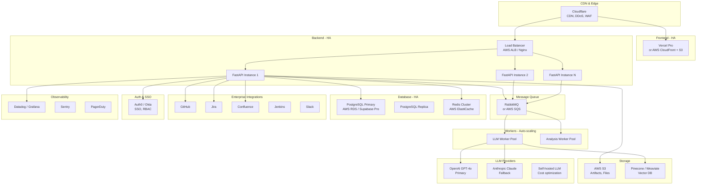
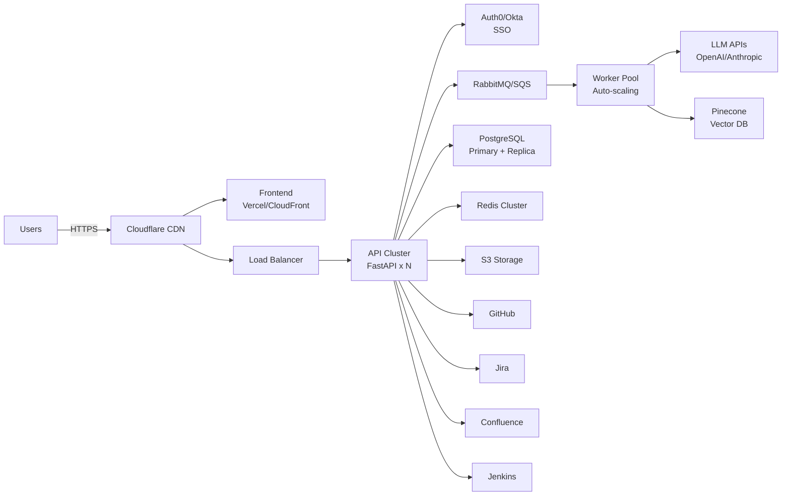
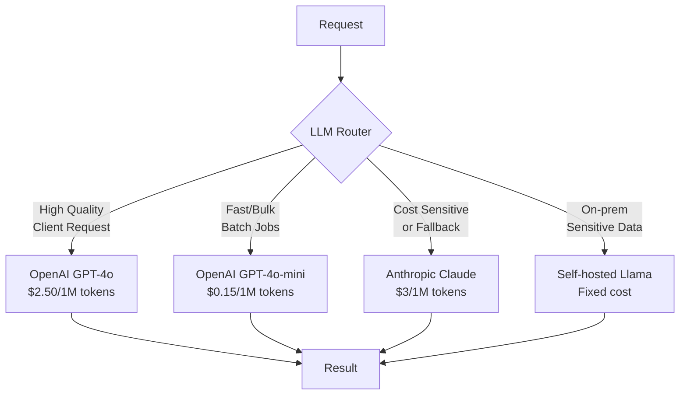
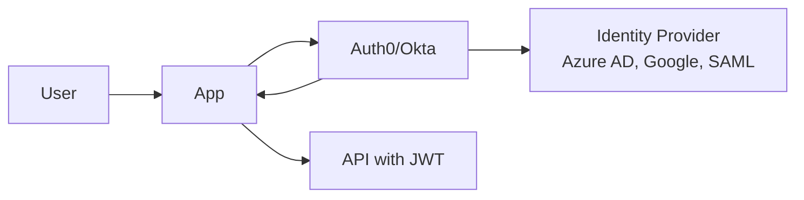
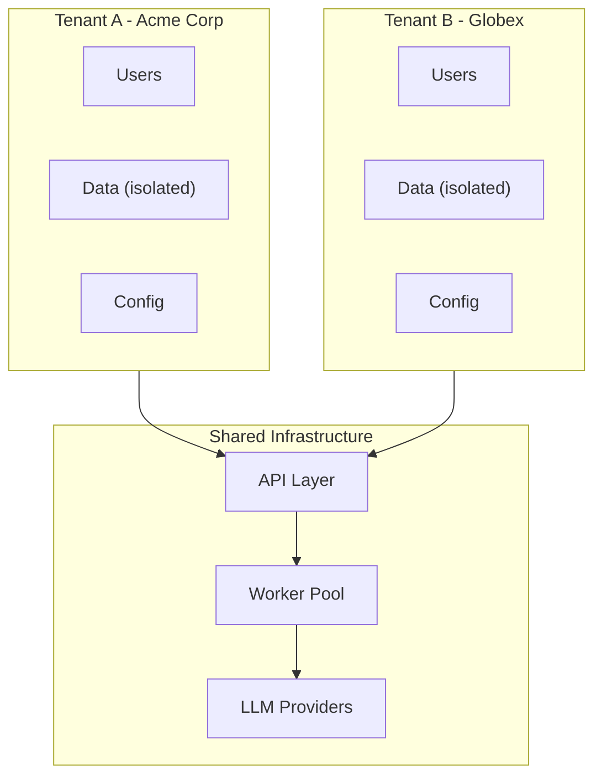
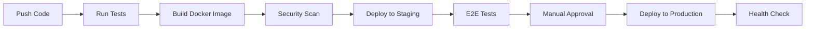

# AI SDLC Co-Pilot — Production High-Level Design (Scalable Stack)

**Version:** 1.0
**Author:** Ali Haidar
**Date:** 2025-12-10
**Status:** Production Reference Architecture
**Cost:** $200–$2,000+/month (scales with usage)

---

## Executive Summary

This is the **production-scale version** of AI SDLC Co-Pilot, designed for enterprise clients, high availability, and multi-tenant SaaS deployment. This architecture handles thousands of users, provides enterprise integrations (Jira, Confluence, Jenkins), and includes proper security, monitoring, and compliance features.

**Target audience:** Enterprise clients, SaaS offering, agencies, teams with 10+ developers.

### Production Capabilities

| Capability | MVP (Free) | Production |
|------------|------------|------------|
| Test case generation | ✅ | ✅ High-throughput |
| PyTest skeleton generation | ✅ | ✅ Batch processing |
| PR review suggestions | ✅ | ✅ With confidence scores |
| GitHub integration | ✅ | ✅ |
| Jira integration | ❌ | ✅ |
| Confluence integration | ❌ | ✅ |
| Jenkins CI integration | ❌ | ✅ |
| SSO (Okta/Azure AD) | ❌ | ✅ |
| Multi-tenant | ❌ | ✅ |
| High availability | ❌ | ✅ |
| SOC2 compliance ready | ❌ | ✅ |

---

## Production Stack Overview



---

## Production Infrastructure

### Recommended Cloud Providers

| Component | Option 1 (AWS) | Option 2 (Managed) | Cost/mo |
|-----------|----------------|---------------------|---------|
| **Compute** | ECS Fargate / EKS | Render Pro / Railway | $100–$500 |
| **Database** | RDS PostgreSQL | Supabase Pro | $50–$200 |
| **Cache** | ElastiCache Redis | Upstash Pro | $30–$100 |
| **Storage** | S3 | Supabase Storage | $10–$50 |
| **Vector DB** | Self-hosted Weaviate | Pinecone | $70–$200 |
| **LLM** | OpenAI API | OpenAI + Anthropic | $100–$1000+ |
| **CDN/WAF** | CloudFront + WAF | Cloudflare Pro | $20–$100 |
| **Auth** | Cognito | Auth0 | $0–$200 |
| **Monitoring** | CloudWatch | Datadog | $50–$300 |
| **CI/CD** | CodePipeline | GitHub Actions | $0–$50 |

**Estimated Total: $400–$2,500/month** (scales with usage)

---

## High-Level Architecture



---

## Component Design (Production)

### 1. Frontend (Vercel Pro / AWS CloudFront)

* **Tech:** React + Vite, Tailwind CSS, React Query
* **Hosting:** Vercel Pro ($20/mo) or AWS CloudFront + S3
* **Features:** 
  - Server-side rendering for SEO
  - Edge caching for performance
  - Preview deployments for PRs
  - Analytics dashboard

### 2. API Gateway (Load Balanced)

* **Tech:** FastAPI, Pydantic, Python 3.11+
* **Deployment:** AWS ECS Fargate or Kubernetes
* **Scaling:** Auto-scale 2–10 instances based on CPU/memory
* **Features:**
  - Rate limiting per tenant
  - Request validation
  - API versioning
  - OpenAPI documentation

### 3. Worker Pool (Auto-scaling)

* **Tech:** Celery + RabbitMQ (or AWS SQS)
* **Scaling:** Auto-scale based on queue depth
* **Workers:**
  - LLM Worker: Prompt construction, API calls, response parsing
  - Analysis Worker: Static analysis, diff parsing, log parsing
  - Artifact Worker: File generation, storage

### 4. Database (High Availability)

* **Tech:** PostgreSQL 15
* **Setup:** Primary + Read Replica
* **Provider:** AWS RDS or Supabase Pro
* **Features:**
  - Automated backups (30 days)
  - Point-in-time recovery
  - Connection pooling (PgBouncer)
  - Encryption at rest

### 5. Cache Layer (Redis Cluster)

* **Tech:** Redis 7
* **Provider:** AWS ElastiCache or Upstash
* **Use Cases:**
  - Session storage
  - Job queue state
  - LLM response caching
  - Rate limiting counters

### 6. Object Storage (S3)

* **Provider:** AWS S3
* **Use:** Generated artifacts, test files, reports
* **Features:**
  - Lifecycle policies (archive after 90 days)
  - Versioning
  - Server-side encryption
  - Pre-signed URLs for downloads

### 7. Vector Database (Pinecone/Weaviate)

* **Use:** RAG context for historical issues, code patterns
* **Provider:** Pinecone (managed) or self-hosted Weaviate
* **Features:**
  - Semantic search for similar issues
  - Code pattern matching
  - Historical context for LLM prompts

### 8. LLM Strategy (Production)



**Provider Priority:**
1. **GPT-4o** — Highest quality for customer-facing features
2. **GPT-4o-mini** — Batch processing, bulk operations
3. **Claude 3.5 Sonnet** — Fallback, long context windows
4. **Self-hosted Llama** — On-prem clients, sensitive data

---

## Enterprise Integrations

### GitHub Integration
- Webhooks for PR events
- GitHub App for better permissions
- Status checks on PRs
- Issue creation with labels

### Jira Integration
- OAuth 2.0 authentication
- Create/update issues
- Link to test cases
- Custom field mapping
- Webhook for bidirectional sync

### Confluence Integration
- Create/update pages
- Publish test matrices
- Auto-generate documentation
- Template support

### Jenkins Integration
- Webhook triggers
- Build log parsing
- Status reporting
- Pipeline integration

### Slack/Teams Integration
- Notification channels
- Interactive messages
- Slash commands
- Approval workflows

---

## Authentication & Authorization

### Auth0 / Okta Integration



**Features:**
- SSO (SAML, OIDC)
- MFA enforcement
- RBAC (Admin, Maintainer, Reviewer, Viewer)
- Tenant isolation
- Audit logging

### RBAC Roles

| Role | Permissions |
|------|-------------|
| **Admin** | All permissions, user management, billing |
| **Maintainer** | Create projects, configure connectors, approve artifacts |
| **Reviewer** | View artifacts, approve/reject suggestions |
| **Viewer** | Read-only access to dashboards and artifacts |

---

## Multi-Tenant Architecture



**Isolation Strategy:**
- Database: Row-level security with `tenant_id`
- Storage: Separate S3 prefixes per tenant
- API: Tenant context from JWT
- Rate limits: Per-tenant quotas

---

## Data Schema (Production)

### Core Tables

```sql
-- Tenants (multi-tenant)
CREATE TABLE tenants (
    id UUID PRIMARY KEY DEFAULT gen_random_uuid(),
    name VARCHAR(255) NOT NULL,
    slug VARCHAR(100) UNIQUE NOT NULL,
    plan ENUM('free', 'pro', 'enterprise') DEFAULT 'free',
    settings JSONB DEFAULT '{}',
    created_at TIMESTAMPTZ DEFAULT NOW(),
    updated_at TIMESTAMPTZ DEFAULT NOW()
);

-- Users with tenant association
CREATE TABLE users (
    id UUID PRIMARY KEY DEFAULT gen_random_uuid(),
    tenant_id UUID REFERENCES tenants(id),
    email VARCHAR(255) NOT NULL,
    name VARCHAR(255),
    role ENUM('admin', 'maintainer', 'reviewer', 'viewer') DEFAULT 'viewer',
    auth_provider VARCHAR(50),
    auth_provider_id VARCHAR(255),
    created_at TIMESTAMPTZ DEFAULT NOW(),
    UNIQUE(tenant_id, email)
);

-- Projects
CREATE TABLE projects (
    id UUID PRIMARY KEY DEFAULT gen_random_uuid(),
    tenant_id UUID REFERENCES tenants(id),
    name VARCHAR(255) NOT NULL,
    repo_url VARCHAR(500),
    settings JSONB DEFAULT '{}',
    created_by UUID REFERENCES users(id),
    created_at TIMESTAMPTZ DEFAULT NOW()
);

-- Jobs with tracking
CREATE TABLE jobs (
    id UUID PRIMARY KEY DEFAULT gen_random_uuid(),
    tenant_id UUID REFERENCES tenants(id),
    project_id UUID REFERENCES projects(id),
    job_type ENUM('ingest', 'pr_review', 'log_parse', 'generate_test'),
    status ENUM('queued', 'running', 'completed', 'failed'),
    priority INTEGER DEFAULT 0,
    input JSONB,
    result JSONB,
    error_message TEXT,
    llm_provider VARCHAR(50),
    llm_tokens_used INTEGER,
    processing_time_ms INTEGER,
    created_at TIMESTAMPTZ DEFAULT NOW(),
    started_at TIMESTAMPTZ,
    completed_at TIMESTAMPTZ
);

-- Artifacts
CREATE TABLE artifacts (
    id UUID PRIMARY KEY DEFAULT gen_random_uuid(),
    tenant_id UUID REFERENCES tenants(id),
    job_id UUID REFERENCES jobs(id),
    artifact_type ENUM('pytest', 'markdown', 'pr_comment', 'diagram', 'pdf'),
    storage_path TEXT,
    metadata JSONB,
    status ENUM('pending', 'approved', 'rejected') DEFAULT 'pending',
    reviewed_by UUID REFERENCES users(id),
    reviewed_at TIMESTAMPTZ,
    created_at TIMESTAMPTZ DEFAULT NOW()
);

-- Audit log
CREATE TABLE audit_logs (
    id UUID PRIMARY KEY DEFAULT gen_random_uuid(),
    tenant_id UUID REFERENCES tenants(id),
    user_id UUID REFERENCES users(id),
    action VARCHAR(100) NOT NULL,
    resource_type VARCHAR(50),
    resource_id UUID,
    details JSONB,
    ip_address INET,
    user_agent TEXT,
    created_at TIMESTAMPTZ DEFAULT NOW()
);

-- Row-level security
ALTER TABLE jobs ENABLE ROW LEVEL SECURITY;
CREATE POLICY tenant_isolation ON jobs
    USING (tenant_id = current_setting('app.tenant_id')::UUID);
```

---

## Security & Compliance

### Security Features

| Feature | Implementation |
|---------|---------------|
| **Encryption at rest** | AWS KMS / database encryption |
| **Encryption in transit** | TLS 1.3 everywhere |
| **Secrets management** | AWS Secrets Manager / HashiCorp Vault |
| **PII redaction** | Automatic scrubbing before storage |
| **Audit logging** | All actions logged with user context |
| **IP allowlisting** | Optional per-tenant webhook IPs |
| **API rate limiting** | Per-tenant, per-endpoint limits |

### Compliance Readiness

| Standard | Status |
|----------|--------|
| SOC 2 Type II | Architecture supports |
| GDPR | Data retention policies, right to delete |
| HIPAA | Can be configured (BAA required) |

---

## Observability & Monitoring

### Logging (Datadog / ELK)

```json
{
  "timestamp": "2025-12-10T10:30:00Z",
  "level": "INFO",
  "service": "api",
  "tenant_id": "uuid",
  "user_id": "uuid",
  "trace_id": "abc123",
  "message": "Job completed",
  "job_id": "uuid",
  "duration_ms": 1523,
  "llm_tokens": 4521
}
```

### Metrics (Prometheus/Datadog)

- `job_processing_duration_seconds` — histogram
- `job_queue_depth` — gauge per job type
- `llm_tokens_used_total` — counter per provider
- `api_request_duration_seconds` — histogram
- `error_rate` — counter per endpoint

### Alerting (PagerDuty)

| Alert | Condition | Severity |
|-------|-----------|----------|
| High error rate | >5% errors in 5min | Critical |
| Queue backlog | >1000 jobs pending | Warning |
| LLM API down | 3 consecutive failures | Critical |
| Database connection pool exhausted | >90% utilized | Critical |
| High latency | p99 >10s | Warning |

---

## Deployment & CI/CD

### Environments

| Environment | Purpose | Auto-deploy |
|-------------|---------|-------------|
| **Development** | Feature branches | On PR |
| **Staging** | Pre-production testing | On merge to `develop` |
| **Production** | Live traffic | Manual approval from `main` |

### Deployment Pipeline



### Infrastructure as Code

- **Terraform** for AWS resources
- **Kubernetes manifests** or **Docker Compose** for services
- **GitHub Actions** for CI/CD pipelines

---

## Cost Breakdown (Production)

### Estimated Monthly Costs

| Component | Low Traffic | Medium Traffic | High Traffic |
|-----------|-------------|----------------|--------------|
| **Compute (API + Workers)** | $100 | $300 | $800 |
| **Database (RDS)** | $50 | $150 | $400 |
| **Cache (ElastiCache)** | $30 | $80 | $200 |
| **Storage (S3)** | $10 | $30 | $100 |
| **Vector DB (Pinecone)** | $70 | $150 | $300 |
| **LLM API** | $100 | $500 | $2000+ |
| **CDN (Cloudflare)** | $20 | $50 | $200 |
| **Auth (Auth0)** | $0 | $100 | $300 |
| **Monitoring (Datadog)** | $50 | $150 | $400 |
| **Total** | **$430** | **$1,510** | **$4,700+** |

### Cost Optimization Strategies

1. **LLM caching** — Cache similar prompts (saves 30-50%)
2. **Batch processing** — Group requests to reduce overhead
3. **Model tiering** — Use GPT-4o-mini for bulk, GPT-4o for quality
4. **Reserved instances** — 30-50% savings on compute
5. **S3 lifecycle** — Archive old artifacts to Glacier

---

## Scaling Strategy

### Horizontal Scaling

| Component | Scale Trigger | Min | Max |
|-----------|--------------|-----|-----|
| **API instances** | CPU >70% | 2 | 10 |
| **LLM Workers** | Queue >100 | 2 | 20 |
| **Analysis Workers** | Queue >50 | 1 | 10 |

### Database Scaling

- **Vertical:** Start with db.t3.medium, scale to db.r5.xlarge
- **Read replicas:** Add replicas for read-heavy dashboards
- **Connection pooling:** PgBouncer for efficient connections

---

## Disaster Recovery

| Scenario | RTO | RPO | Strategy |
|----------|-----|-----|----------|
| **Database failure** | 5 min | 1 min | Multi-AZ failover |
| **Region outage** | 30 min | 5 min | Cross-region replica |
| **Data corruption** | 1 hour | 24 hours | Point-in-time recovery |
| **Full disaster** | 4 hours | 24 hours | Restore from backup |

---

## Migration from MVP

### Step-by-Step Migration

1. **Set up production infrastructure** (Terraform)
2. **Migrate database** (pg_dump/restore with downtime window)
3. **Update environment variables**
4. **Deploy API and workers to production cluster**
5. **Configure monitoring and alerting**
6. **Update DNS / load balancer**
7. **Run smoke tests**
8. **Gradual traffic shift**

### Migration Checklist

- [ ] Production infrastructure provisioned
- [ ] Database migrated and tested
- [ ] Secrets in Secrets Manager
- [ ] SSL certificates configured
- [ ] Monitoring dashboards ready
- [ ] Alerting configured
- [ ] Runbooks documented
- [ ] On-call rotation set up

---

## Roadmap (Production Features)

### Phase 3 (Months 1-2): Enterprise Connectors
- [ ] Jira integration (full CRUD)
- [ ] Confluence integration
- [ ] Jenkins CI integration
- [ ] SSO (SAML, OIDC)

### Phase 4 (Months 3-4): Scale & Optimize
- [ ] Multi-tenant billing (Stripe)
- [ ] Usage analytics dashboard
- [ ] LLM cost tracking per tenant
- [ ] Performance optimization

### Phase 5 (Months 5-6): Advanced Features
- [ ] Model fine-tuning pipeline
- [ ] Agentic automation (auto-fix + PR)
- [ ] Custom prompt templates per tenant
- [ ] API for third-party integrations

---

## Support & Operations

### Runbooks

1. **High queue depth** — Scale workers, check LLM API status
2. **Database slow queries** — Check EXPLAIN, add indexes
3. **LLM API errors** — Failover to backup provider
4. **Memory pressure** — Scale instances, check for leaks

### On-Call

- Primary: Engineering lead
- Secondary: Backend engineer
- Escalation: CTO

### SLA Targets (Enterprise)

| Metric | Target |
|--------|--------|
| Uptime | 99.9% |
| API latency (p95) | <500ms |
| Job processing (p95) | <60s |
| Support response (critical) | <1 hour |

---

## See Also

- **`hld-mvp-free.md`** — Zero-cost MVP version for development
- **`lld-prompts.md`** — LLM prompt templates and schemas (to be created)
- **`runbooks/`** — Operational runbooks (to be created)
