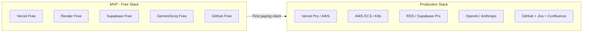

# AI SDLC Co-Pilot — High-Level Design Index

**Version:** 2.0
**Author:** Ali Haidar
**Date:** 2025-12-10

---

## Overview

This project has **two separate HLD documents** to support different deployment scenarios:

| Document | Use Case | Cost |
|----------|----------|------|
| **[hld-mvp-free.md](./hld-mvp-free.md)** | Solo dev, portfolio, MVP, Upwork gigs | **$0/month** |
| **[hld-production.md](./hld-production.md)** | Enterprise, SaaS, multi-tenant, scale | $400–$2,500+/month |

---

## Quick Comparison



| Feature | MVP (Free) | Production |
|---------|------------|------------|
| **Frontend** | Vercel Free | Vercel Pro / CloudFront |
| **Backend** | Render Free (sleeps) | AWS ECS / Kubernetes |
| **Database** | Supabase Free (500MB) | RDS / Supabase Pro |
| **Cache** | Upstash Free (10K/day) | ElastiCache / Upstash Pro |
| **LLM** | Gemini/Groq (free) | OpenAI GPT-4o |
| **Auth** | GitHub OAuth | Auth0 / Okta SSO |
| **Integrations** | GitHub only | GitHub + Jira + Confluence + Jenkins |
| **Multi-tenant** | ❌ | ✅ |
| **High Availability** | ❌ | ✅ |
| **Cost** | **$0/month** | **$400–$2,500+/month** |

---

## Which HLD Should I Use?

### Use MVP (Free) If:
- 🎯 You're a solo developer
- 🎯 Building a portfolio project
- 🎯 Testing the concept
- 🎯 Doing Upwork/freelance gigs
- 🎯 Interviewing (need a demo)
- 🎯 Budget is $0

### Use Production If:
- 🏢 You have paying enterprise clients
- 🏢 Need Jira/Confluence integration
- 🏢 Require SSO (Okta/Azure AD)
- 🏢 Need high availability (99.9% uptime)
- 🏢 Have compliance requirements (SOC2, GDPR)
- 🏢 Multiple tenants/teams

---

## Migration Path

```
┌─────────────────┐     ┌─────────────────┐     ┌─────────────────┐
│   MVP (Free)    │────▶│  First Client   │────▶│   Production    │
│   $0/month      │     │  $50-100/month  │     │  $400+/month    │
└─────────────────┘     └─────────────────┘     └─────────────────┘
     │                        │                        │
     ▼                        ▼                        ▼
  • Supabase Free         • Render $7/mo           • AWS / GCP
  • Render Free           • Supabase Pro           • RDS + ElastiCache
  • Gemini Free           • OpenAI API             • Full monitoring
  • GitHub only           • Basic Jira             • All integrations
```

---

## Documents

### 📄 [hld-mvp-free.md](./hld-mvp-free.md)
The **zero-cost MVP** version using all free tiers:
- Complete stack for $0/month
- Step-by-step setup guide
- Free LLM providers (Gemini, Groq, Ollama)
- GitHub-only integrations
- 30-day implementation plan

### 📄 [hld-production.md](./hld-production.md)
The **production-scale** version for enterprise:
- High-availability architecture
- Multi-tenant design
- Enterprise integrations (Jira, Confluence, Jenkins)
- SSO and RBAC
- Security and compliance
- Cost breakdown by scale

---

## Start Here

**For solo devs / MVP:**
1. Read [hld-mvp-free.md](./hld-mvp-free.md)
2. Sign up for free services (links provided)
3. Follow the 30-day implementation plan

**For enterprise / production:**
1. Start with MVP to validate the concept
2. When you have paying clients, read [hld-production.md](./hld-production.md)
3. Follow the migration checklist

---
