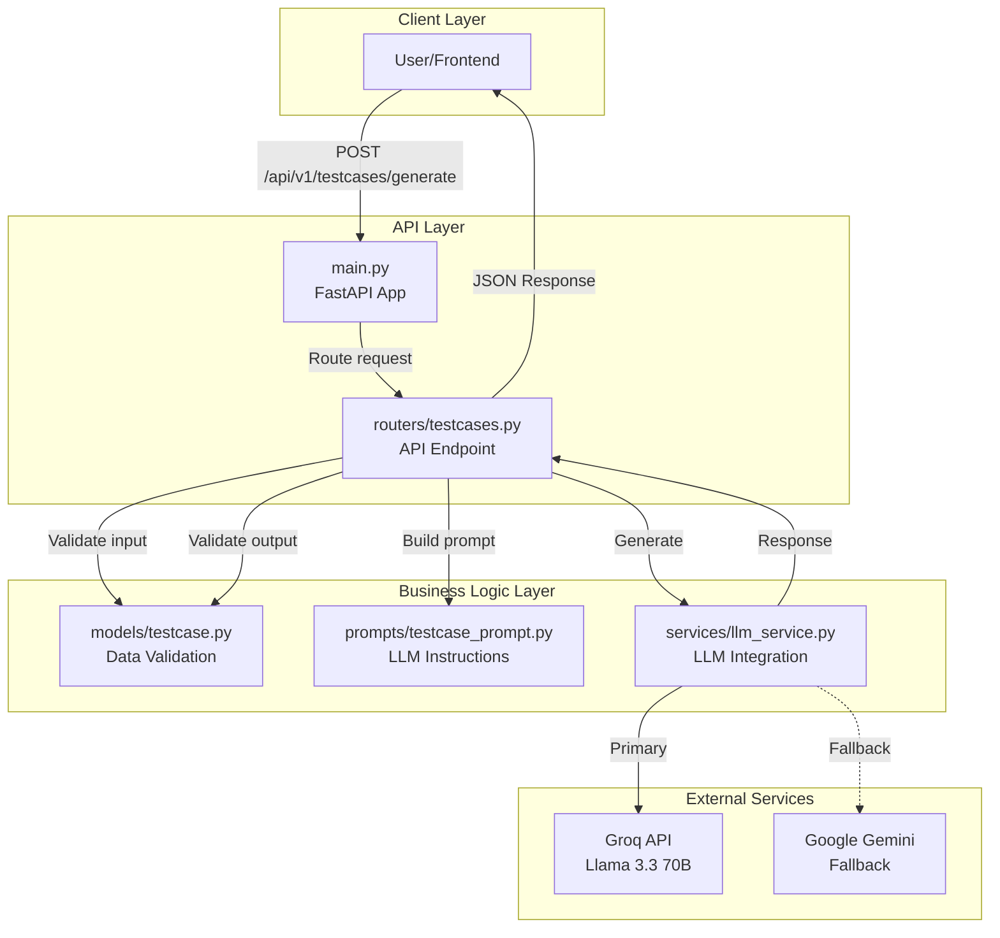
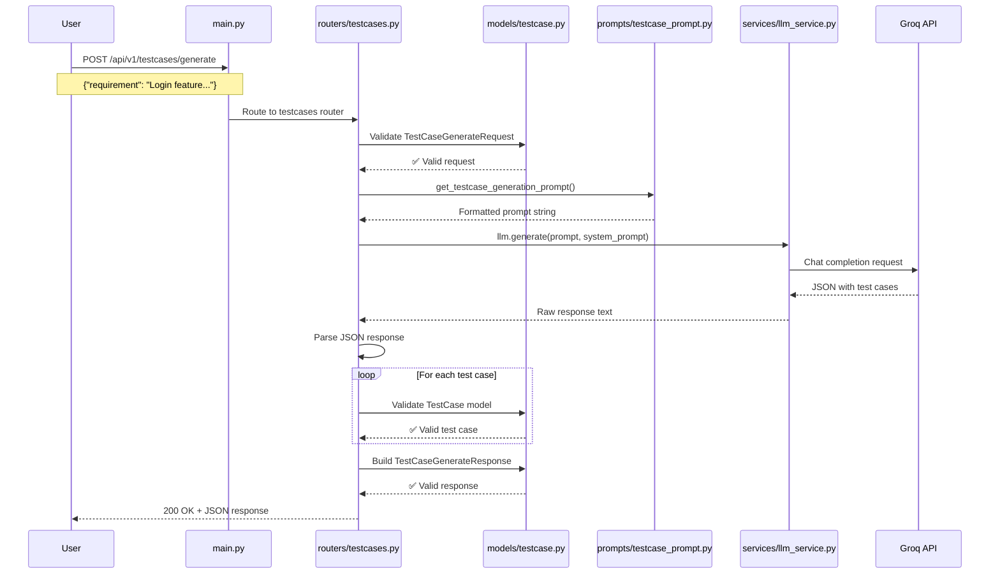
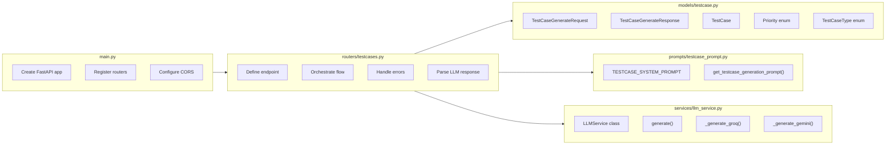
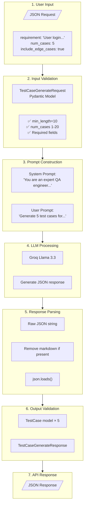
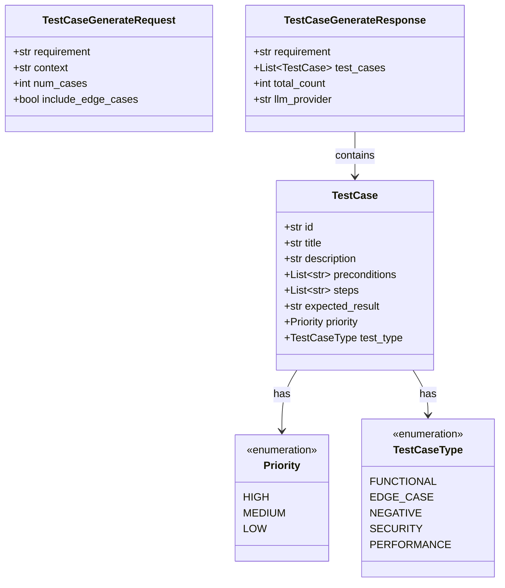
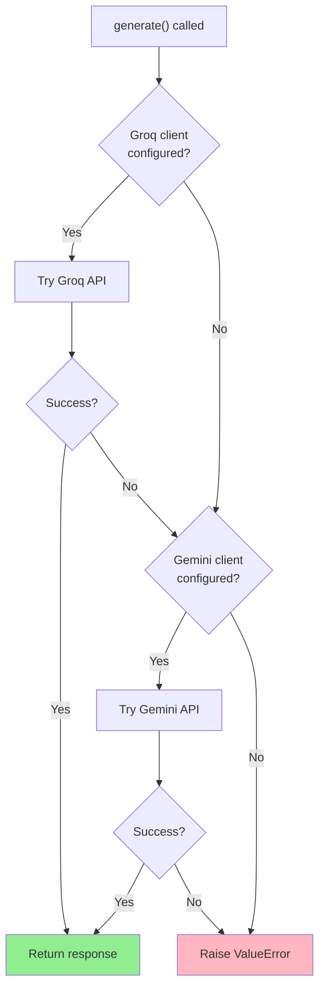

# Test Case Generation - Architecture & Data Flow

This document explains how the test case generation feature works in AI SDLC Co-Pilot.

---

## High-Level Architecture



---

## Request/Response Flow



---

## File Responsibilities



---

## Data Transformation Pipeline



---

## Model Relationships



---

## LLM Fallback Strategy



---

## Example Request/Response

### Request
```json
POST /api/v1/testcases/generate
{
    "requirement": "User should be able to login with email and password",
    "num_cases": 5,
    "include_edge_cases": true
}
```

### Internal Prompt (sent to LLM)
```
System: You are an expert QA engineer specializing in test case design...

User: Generate exactly 5 test cases for the following requirement.

Requirement:
User should be able to login with email and password

Include a mix of:
- Functional tests (happy path)
- Edge cases (boundary conditions)
- Negative tests (invalid inputs, error handling)
- Security tests (if applicable)

Respond with ONLY this JSON structure...
```

### Response
```json
{
    "requirement": "User should be able to login with email and password",
    "test_cases": [
        {
            "id": "TC001",
            "title": "Successful Login with Valid Credentials",
            "description": "Validates user login with correct email and password",
            "preconditions": ["User has a valid account", "User is on login page"],
            "steps": ["Enter valid email", "Enter valid password", "Click login"],
            "expected_result": "User is logged in and redirected to dashboard",
            "priority": "high",
            "test_type": "functional"
        }
        // ... 4 more test cases
    ],
    "total_count": 5,
    "llm_provider": "groq"
}
```

---

## File Structure

```
backend/app/
├── main.py                      # FastAPI app entry point
│   └── Imports and registers testcases router
│
├── routers/
│   ├── __init__.py
│   └── testcases.py             # POST /api/v1/testcases/generate
│       ├── Validates request using models
│       ├── Builds prompt using prompts module
│       ├── Calls LLM service
│       ├── Parses JSON response
│       └── Returns validated response
│
├── models/
│   ├── __init__.py
│   └── testcase.py              # Pydantic models
│       ├── Priority (enum)
│       ├── TestCaseType (enum)
│       ├── TestCase (model)
│       ├── TestCaseGenerateRequest (model)
│       └── TestCaseGenerateResponse (model)
│
├── prompts/
│   ├── __init__.py
│   └── testcase_prompt.py       # LLM prompt templates
│       ├── TESTCASE_SYSTEM_PROMPT (constant)
│       └── get_testcase_generation_prompt() (function)
│
└── services/
    ├── __init__.py
    └── llm_service.py           # LLM integration
        ├── LLMService (class)
        │   ├── generate()
        │   ├── _generate_groq()
        │   └── _generate_gemini()
        └── get_llm_service() (singleton factory)
```

---

## Key Design Decisions

| Decision | Rationale |
|----------|-----------|
| **Pydantic models** | Automatic validation, OpenAPI docs, type safety |
| **Separate prompts file** | Easy to iterate on prompts without touching code |
| **Router pattern** | Organize endpoints by feature, scalable |
| **Service layer** | Decouple LLM logic from HTTP handling |
| **Singleton LLM service** | Reuse client connections, avoid re-initialization |
| **Fallback strategy** | Resilience if primary LLM fails |
| **JSON output from LLM** | Structured, parseable, validatable |
